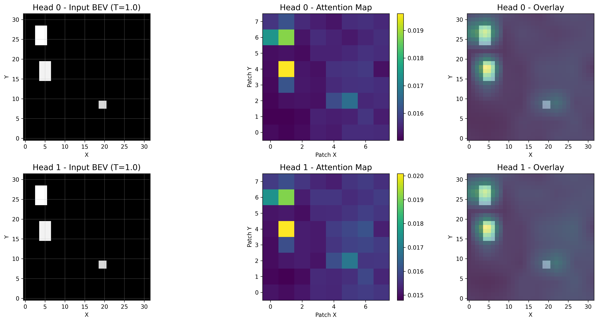
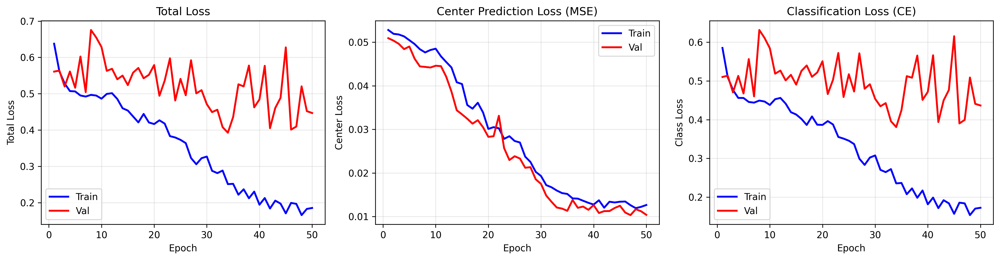
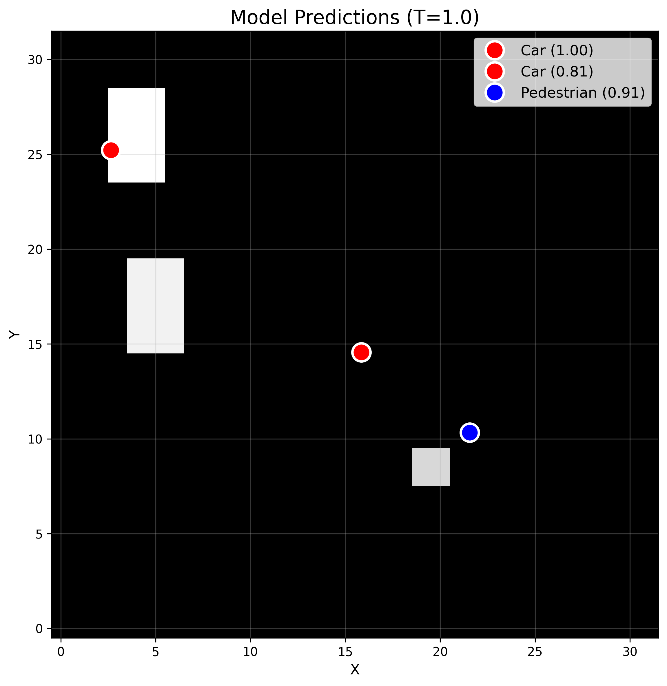
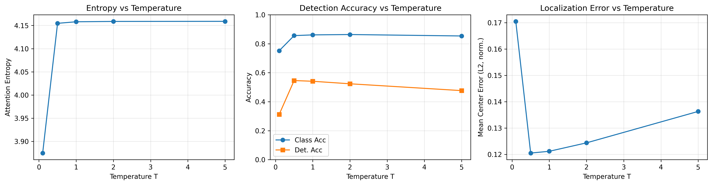
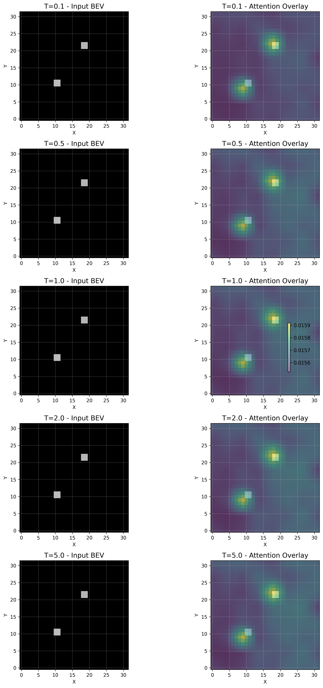

# Lightweight BEV Transformer – Attention & Temperature

Tiny PyTorch codebase for playing with transformer attention on simple BEV (bird’s-eye-view) grids and seeing how the softmax **temperature** changes attention patterns and downstream predictions.

<p align="center">
  
</p>

---

## 1. What this project does

- Generates **synthetic BEV grids** (32×32) with rectangles standing in for:
  - cars (5×3)
  - pedestrians (2×2)
- Trains a **small transformer** over BEV patches:
  - patch embedding: 4×4 → 8×8 = 64 patches  
  - 2 encoder layers, 2 heads, 64-dim embeddings
- Uses **object queries + soft-argmax** detection head:
  - predicts object centers (x, y in [0,1])
  - predicts class (car vs pedestrian)
- Exposes internal **self-attention maps** so you can:
  - overlay them on the BEV grid
  - compare different **temperatures** in the softmax

The whole thing is CPU-friendly and stays under ~100k parameters.

---

## 2. Repo structure

```text
bev-attention-viz/
├── README.md
├── requirements.txt
├── train.py                 # training script
├── visualize.py             # attention + prediction visualizations
├── temperature_study.py     # metrics & qualitative comparison across temperatures
├── data/
│   ├── generate_bev.py      # synthetic BEV generator + sample plots
│   └── dataset.py           # BEVDataset + DataLoader helpers
├── model/
│   ├── attention.py         # scaled dot-product attention w/ temperature
│   ├── transformer.py       # tiny BEV transformer encoder
│   └── detection.py         # query-to-patch head with soft-argmax centers
└── outputs/                 # generated plots & checkpoints
````

---

## 3. Setup

Tested with Python 3.9+, CPU or GPU.

```bash
# (optional) create a venv
python -m venv .venv
source .venv/bin/activate      # Windows: .venv\Scripts\activate

# install deps
pip install -r requirements.txt
```

Main dependencies:

* `torch`
* `numpy`
* `matplotlib`
* `seaborn`
* `tqdm`
* `scipy`

---

## 4. Quick start

### 4.1 Train the BEV transformer

```bash
python train.py
```

This will:

* generate 1,000 synthetic BEV samples
* train for 50 epochs
* save:

  * `outputs/best_model.pt` – best validation loss
  * `outputs/final_model.pt` – last epoch
  * `outputs/training_curves.png` – loss curves

<p align="center">
  
</p>

Hyperparameters live in the `config` dict near the top of `train.py` (grid size, #samples, #layers, learning rate, etc.).

---

### 4.2 Visualize attention on a sample

```bash
python visualize.py
```

This script:

* loads `outputs/best_model.pt`
* generates a fresh mini-dataset
* picks a sample with ≥2 objects
* writes:

  * `outputs/bev_samples.png` – a few raw BEV examples
  * `outputs/attention_layer0.png` – layer 0 attention
  * `outputs/attention_layer1.png` – layer 1 attention
  * `outputs/attention_distribution.png` – attention histogram
  * `outputs/model_predictions.png` – predictions vs ground truth

Example outputs:

<p align="center">
  
</p>

<p align="center">
  
</p>

Each attention figure is also saved as a vector PDF next to the PNG, e.g.

* `outputs/attention_layer0.pdf`
* `outputs/attention_layer1.pdf`

The prediction plot overlays model outputs and ground-truth centers:

<p align="center">
  
</p>

Red/blue markers are predictions (with confidence), green/cyan markers are ground truth. Dashed yellow lines connect each query slot to its corresponding ground-truth object.

---

### 4.3 Temperature study

```bash
python temperature_study.py
```

This script evaluates the trained model across temperatures

[
T \in {0.1,; 0.5,; 1.0,; 2.0,; 5.0}
]

and writes:

* `outputs/temperature_metrics.png` – entropy / accuracy / center error vs T
* `outputs/temperature_comparison.png` – qualitative comparison across T
* plus matching `.pdf` versions.

Metrics figure:

<p align="center">
  
</p>

Qualitative comparison (each row: input + overlay for one T):

<p align="center">
  
</p>

---

## 5. Data & labels

**Grids**

* BEV grid: `32 × 32` float32, values in `[0, 1]`
* Synthesized on the fly in `data/generate_bev.py`, no external data

**Objects**

* Cars:

  * rectangle: `5 × 3` cells
  * class id: `0`
* Pedestrians:

  * rectangle: `2 × 2` cells
  * class id: `1`
* 1–3 objects per grid
* Some random intensity jitter per object (still easily visible)

**Labels**

* For each sample, a list of dictionaries:

  ```python
  {"x": center_x_norm, "y": center_y_norm, "class": class_id}
  ```

* Centers are normalized to `[0, 1]` in grid coordinates.

* In `BEVDataset`, objects are **sorted by (x, y)** so query slot 0 always corresponds to the leftmost object, etc.

* Targets per sample (padded to `max_objects=3`):

  * `centers`: `(3, 2)` – normalized (x, y)
  * `classes`: `(3,)` – car / pedestrian or `-1` for padding
  * `valid_mask`: `(3,)` – which slots are real objects

---

## 6. Model

### 6.1 BEV transformer

Defined in `model/transformer.py`.

* Patch embedding:

  * `Conv2d(1 → 64, kernel=4, stride=4)`
  * `32×32 → 8×8` patches → 64 tokens
* Positional encoding:

  * learnable `(1, 64, 64)` tensor added to patch embeddings
* Encoder:

  * 2× `TransformerEncoderLayer` with:

    * `MultiHeadAttention(embed_dim=64, num_heads=2)`
    * FFN: `64 → 128 → 64`
    * residual + LayerNorm

Attention implementation lives in `model/attention.py`:

[
\text{Attention}(Q,K,V) = \text{softmax}\left(\frac{QK^\top}{\sqrt{d_k} \cdot T}\right)V
]

where `T` is the **temperature** parameter exposed all the way up to `visualize.py` and `temperature_study.py`.

The attention module also reports basic stats (max weight, entropy, sparsity) to make temperature effects easy to inspect.

---

### 6.2 Detection head (queries + soft-argmax)

Defined in `model/detection.py`.

* Learnable **object queries**: `num_queries × embed_dim`
* For each query:

  1. Project query / patch features:

     * `Q = W_q * query`
     * `K = W_k * features`
     * `V = W_v * features`
  2. Compute scores and attention over **patches**:
     [
     \alpha_{q,p} = \text{softmax}_p \left( \frac{Q_q K_p^\top}{\sqrt{d}} \right)
     ]
  3. Build a **context vector**:
     [
     c_q = \sum_p \alpha_{q,p} V_p
     ]
  4. Compute the **center** using a soft-argmax over patch centers:
     [
     \hat{\mathbf{x}}*q = \sum_p \alpha*{q,p} \mathbf{u}_p
     ]
     where (\mathbf{u}_p) is the normalized (x, y) of patch `p`.
  5. Class logits from context via a small MLP.

Outputs:

* `pred_centers`: `(B, num_queries, 2)` – normalized centers in `[0, 1]`
* `pred_logits`: `(B, num_queries, num_classes)`

---

### 6.3 Loss & training

Loss is defined in `train.py` as `DetectionLoss`:

* **Center loss** – MSE over valid slots:

  [
  \mathcal{L}*{\text{center}} = \frac{1}{N*{\text{valid}}}
  \sum_{i \in \text{valid}} |\hat{\mathbf{x}}_i - \mathbf{x}_i|_2^2
  ]

* **Class loss** – cross-entropy over valid slots.

* Total:

  [
  \mathcal{L} = \lambda_{\text{center}} \mathcal{L}*{\text{center}} +
  \lambda*{\text{class }} \mathcal{L}_{\text{class}}
  ]

Optimizer: `Adam(lr=1e-3, weight_decay=1e-4)`.

The training script prints per-epoch breakdown (total, center, class) and saves checkpoints every 10 epochs plus the best checkpoint by validation loss.

---

## 7. What the temperature study shows

Empirically (see `temperature_metrics.png` and `temperature_comparison.png`):

* **Low T (e.g. 0.1)**

  * Attention distributions are **peaked**: a few patches dominate.
  * Entropy is low, max weight is high.
  * Detection tends to latch onto very specific patch locations.

* **Medium T (0.5–1.0)**

  * Attention spreads enough to cover each object region.
  * Center predictions are stable and accurate.
  * Classification accuracy is usually best in this range.

* **High T (2.0–5.0)**

  * Attention becomes smooth / almost uniform.
  * Entropy grows, max weights shrink.
  * Soft-argmax centers drift toward “average” positions,
    and both detection and classification degrade.

The qualitative comparison plot makes this easy to see: for the same input BEV, rows with higher T show broader, more washed-out overlays.

---

## 8. Tweaking & extending

A few easy knobs to play with:

* **Training config** – edit `config` in `train.py`:

  * `n_samples`, `num_layers`, `num_heads`, `embed_dim`, etc.
* **Object shapes / density** – change `object_specs` or object counts in
  `data/generate_bev.py`.
* **Temperature ranges** – adjust `TEMPERATURES` in `temperature_study.py`.
* **More heads / layers** – the code will automatically visualize all heads for the chosen layer.

Potential extensions if you want to push the idea:

* Add a **decoder** and make it closer to DETR-style detection.
* Swap synthetic rectangles for more complex shapes (e.g., Gaussian blobs).
* Wrap the visualizer in a small Streamlit or Gradio app with a temperature slider.

---

## 9. Outputs recap

After running all scripts you should have at least these files in `outputs/`:

* **Data / training**

  * `bev_samples.png`
  * `training_curves.png`
* **Model**

  * `best_model.pt`
  * `final_model.pt`
* **Attention**

  * `attention_layer0.png` / `.pdf`
  * `attention_layer1.png` / `.pdf`
  * `attention_distribution.png`
* **Predictions**

  * `model_predictions.png`
* **Temperature**

  * `temperature_metrics.png` / `.pdf`
  * `temperature_comparison.png` / `.pdf`

